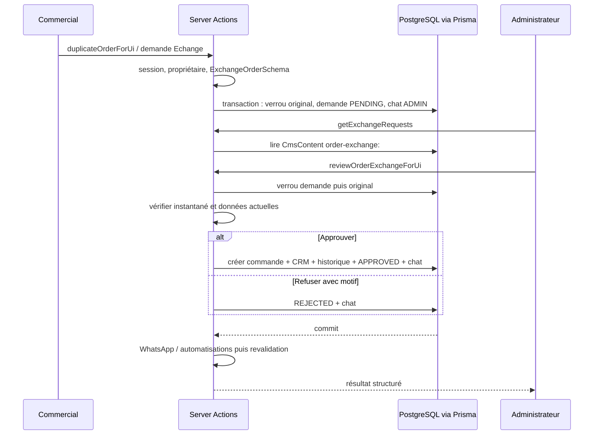

# Audit des demandes d’échange

## Correctifs locaux après audit — 18 septembre 2026

Les constats ci-dessous décrivent l’état avant correction. Depuis : lecture structurée avec `StoredExchangeRequestSchema` (sans expiration des archives), isolation et comptage des JSON illisibles, façade de chargement avec erreur récupérable, erreurs de validation par champ, diagnostic UUID/étape/code Prisma sans message ni payload, correction admin de date/adresse lors de l’approbation et audit avant/après dans la demande. `ExchangeCorrectionSchema` interdit les autres champs ; le contrôle de version/propriétaire de l’original reste en place. Aucune réparation automatique des données historiques.

L’écran recharge explicitement la liste après décision. WhatsApp et automatisations sont isolés ; une erreur externe ou de revalidation après commit ne transforme plus l’approbation en échec apparent. Il n’existe toujours pas de file de reprise des notifications.

Tests simulés étendus et TypeScript/lint ciblé passent. Lint global : 744 erreurs et 83 avertissements préexistants. Aucun accès à la production, aucune migration ni validation navigateur réelle. Restent ouverts : cohérence des builds déployés, règles financières, références concurrentes, pagination, édition des autres champs et circuit des demandes dont l’original a changé.

Vérifié le 18 septembre 2026 dans le dépôt local. Périmètre : `/zangochap-manager/orders/exchanges`, soumission commerciale, approbation, création de commande, données, permissions et erreurs. Analyse statique et tests isolés ; aucune lecture ou écriture de base réelle, aucun déploiement. Les constats locaux ne prouvent pas la version en production.

## Fonctionnement vérifié

La page est une file de demandes, pas le formulaire de création. Un commercial propose un échange depuis une commande lui appartenant. La proposition est conservée dans `CmsContent.data`, sous une clé `order-exchange:<UUID>`, avec un instantané de la commande originale. Un message de rôle prévient les administrateurs.

L’administrateur ou le développeur peut approuver ou refuser. L’approbation crée une **nouvelle commande `Echange`, `CONFIRMED`**, attribuée au commercial demandeur et confirmée au nom du validateur. L’original reçoit une entrée d’historique ; son statut livré et son règlement ne sont pas annulés. Le refus ne crée aucune commande et exige un commentaire. La décision est notifiée au commercial dans le chat.

**Aucune interdiction fondée sur l’ancienneté, le statut livré ou le règlement de l’original n’apparaît dans ce parcours.** Ces scénarios passent dans les tests simulés. La date future exigée concerne la nouvelle livraison, pas la livraison originale.



## Carte des responsabilités

| Fichier | Rôle / symboles |
|---|---|
| `app/zangochap-manager/orders/exchanges/page.tsx` | Page dynamique, `getSession`, chargement et restriction des rôles |
| `modules/orders/components/ExchangeRequestsClient.tsx` | `ExchangeRequestsClient`, filtres, recherche, cartes, `refresh`, `review` |
| `modules/orders/components/exchanges.css` | Grille de deux colonnes, une colonne sous 1 000 px, styles mobiles |
| `modules/orders/actions/index.ts` | Façades `getExchangeRequests`, `reviewOrderExchangeForUi`, `duplicateOrderForUi` |
| `modules/orders/actions/exchange-actions.ts` | `requestOrderExchange`, `reviewOrderExchange`, transactions et messages |
| `modules/orders/types/exchange.ts` | `ExchangeOrderSchema`, `parseExchangeDate`, type `ExchangeRequest`, préfixe de stockage |
| `modules/orders/actions/order-creation-service.ts` | `createOrderWithContext` : commande, articles, paiement, cadeaux, CRM, promotions |
| `modules/orders/helpers/index.ts` | `generateUniqueRef`, `upsertCustomerFromOrder` |
| `modules/auth/actions.ts`, `lib/auth.ts` | `getSession`, `ensureAuth` ; compte et rôle relus en base après validation JWT |
| `lib/stale-server-action.ts` | `reloadOnStaleServerAction` : rechargement protégé si message explicite |
| `app/zangochap-manager/error.tsx` | `ManagerError`, frontière générale d’erreur et digest |
| `prisma/schema.prisma` | `CmsContent`, `Order`, `OrderItem`, `Customer`, `ChatMessage`, `User` |

Le parcours utilise les Server Actions Next.js, sans route REST dédiée aux décisions.

## Permissions et garanties existantes

- Le commercial ne charge que ses demandes via filtre JSON `commercialId` côté serveur. La propriété de l’original est revérifiée à la soumission.
- L’admin et le développeur consultent et décident ; un commercial ne peut pas approuver en appelant directement l’action. Le rôle développeur est autorisé par `ensureAuth`.
- Verrou de l’original à la soumission : une seule demande en attente par original dans ce parcours.
- Verrou de la demande à la décision : une répétition de la même décision retourne le résultat existant ; une décision opposée est rejetée.
- Création, historique, changement de statut de demande et message interne partagent la transaction. Une erreur avant commit doit tout annuler.
- Le serveur valide notamment adresse, motif, date, articles, quantités et montants bornés. Hors Abidjan, le moyen de paiement et un numéro de payeur sont obligatoires.
- Les médias intégrés sont chargés avant la transaction après contrôle de propriété. Risque secondaire : un fichier peut rester inutilisé si la transaction échoue ensuite.

## Constats prioritaires

Les priorités ci-dessous indiquent l’ordre conseillé ; un risque identifié dans le code n’est pas présenté comme un incident reproduit en production.

### 1. Blocages métier certains, peu réparables depuis l’écran — priorité haute

Dans `reviewOrderExchange`, toute différence de `original.updatedAt` ou de propriétaire provoque un refus d’approbation. Une mise à jour de l’original, même sans changement des articles proposés, suffit donc à rendre la demande obsolète. Cette protection évite une validation aveugle mais utilise une version globale trop large pour distinguer les modifications pertinentes.

`ExchangeOrderSchema` est exécuté à nouveau lors de l’approbation. Une livraison demandée hier devient invalide aujourd’hui. Il n’existe sur cette page aucune édition de date, correction d’adresse ou demande de complément : il faut refuser puis recréer. **La demande reste PENDING après l’échec**, ce qui bloque également une nouvelle soumission tant qu’elle n’est pas refusée.

Recommandation : afficher ces blocages avant le clic et définir un circuit de correction avec nouvelle validation ; ne pas supprimer les contrôles d’intégrité sans remplacement.

### 2. Montants acceptés depuis la proposition — priorité haute

`createOrderWithContext` calcule `calculatedTotal`, puis choisit `data.total` lorsqu’il est fourni. Le schéma borne les nombres mais ne garantit pas la concordance total / lignes ni la conformité des prix avec le catalogue. La carte reprend également `payload.total` sous l’intitulé « Articles ».

Un montant incohérent peut donc être enregistré après approbation. L’approbation humaine ne remplace pas les invariants serveur exigés par `AGENT.md`. Définir les prix modifiables, remises et compensations d’échange, recalculer les totaux autoritaires et montrer le montant réellement dû avant validation.

### 3. Données persistées non validées au chargement — priorité haute

`getExchangeRequests` convertit `row.data` par assertion TypeScript `as ExchangeRequest`, sans validation à l’exécution. Le composant accède directement à `payload.items`, `payload.customerName` et aux chaînes recherchées. Un ancien JSON incomplet ou mal formé peut faire échouer tout l’écran. La décision accède également à `request.payload.exchangeReason` avant de parser le payload.

**Risque confirmé par la structure du code ; présence de demandes mal formées en production inconnue.** Ajouter un schéma de lecture versionné et isoler les demandes invalides avec un diagnostic exploitable, sans les supprimer.

### 4. Erreurs serveur trop peu identifiables — priorité haute

`reviewOrderExchangeForUi` transforme les erreurs attendues en réponses lisibles. Pour une erreur inattendue, le log ne conserve que `error.name` : ni code Prisma, ni étape, ni identifiant de corrélation. Les erreurs Zod hors date deviennent un message global ; l’admin ne voit pas le champ précis à corriger. Certaines erreurs métier du service partagé ne sont pas couvertes par la liste de préfixes.

Le chargement initial reste susceptible de remonter jusqu’à `ManagerError`. La présence de la façade ne garantit donc pas que toutes les erreurs de page seront lisibles. Journaliser des codes techniques et étapes sans données client, puis retourner une référence de diagnostic. Séparer les erreurs de chargement, de validation, de transaction et de revalidation après commit.

### 5. Collision concurrente de référence possible — priorité moyenne

La référence `ECHANGE` de l’original est préférée. Si indisponible, `generateUniqueRef` lit les références puis cherche un numéro libre. Aucun verrou global ne réserve le candidat entre cette lecture et l’insertion. Deux approbations sur des originaux distincts peuvent choisir le même candidat de secours.

La contrainte unique protège la base mais une transaction peut échouer. `createOrderWithContext` relance l’erreur lorsqu’une transaction externe est fournie ; l’approbation n’a pas de reprise globale. Les tests actuels ne reproduisent pas une concurrence PostgreSQL réelle. Prévoir une allocation atomique ou une reprise bornée de la transaction complète.

### 6. Liste non bornée et rafraîchissement partiel — priorité moyenne

Toutes les demandes et leurs articles sont chargés ; filtre, recherche et compteurs sont calculés dans le navigateur. Aucun `take`, curseur ou filtre de statut serveur. Le coût augmente avec l’historique.

`useState(initialRequests)` n’est pas resynchronisé avec de nouvelles props. La décision met à jour localement une seule demande ; `router.refresh()` ne suffit pas à remplacer cet état déjà initialisé. Le bouton Actualiser recharge explicitement la liste, mais aucune synchronisation entre administrateurs n’existe sur cet écran. Paginer côté serveur et choisir une stratégie explicite de rafraîchissement.

### 7. Notifications externes sans reprise — priorité moyenne

WhatsApp et `triggerAutomations` sont exécutés après commit dans un même `try`. Une exception du premier appel empêche le second ; l’erreur est ignorée. L’échange peut être créé sans notification externe ni trace locale de l’échec. Le chat interne, lui, est transactionnel. Prévoir des traitements séparés et une reprise idempotente si ces notifications sont obligatoires.

### 8. Retour physique et comptabilité à préciser — décision métier

Ce parcours crée une commande, mais ne matérialise pas à lui seul la reprise de l’article original, un remboursement ou une compensation financière. Le lien est conservé dans le JSON de demande et dans les notes/historiques ; pas de relation dédiée d’échange dans le modèle `Order` examiné.

`upsertCustomerFromOrder` incrémente `totalOrders` et `totalSpent` pour le nouvel échange. Cela peut surévaluer les achats si un échange doit être financièrement neutre. Ce comportement est vérifié ; son caractère incorrect dépend de la définition métier de ces compteurs. Clarifier les frais, la différence de prix, l’ancien paiement, le retour en stock et les statistiques attendues.

## Interface

La grille compacte demandée existe : deux colonnes sur écran large, une sur écran plus étroit. Filtres par statut, recherche, état vide, détails repliables, liens original/échange, commentaire et état occupé sont présents. Le refus est désactivé tant que le commentaire est vide.

Améliorations utiles : afficher une raison de blocage sur chaque demande, comparer anciens et nouveaux articles, rendre explicite le total à payer et les frais, afficher les champs invalides, conserver un état de traitement par carte plutôt que bloquer toutes les cartes. La proposition peut actuellement rester fermée lors de l’approbation. Aucune vérification visuelle navigateur/mobile n’a été effectuée pendant cet audit.

## Lecture des erreurs de production transmises

Les logs fournis montrent des `Failed to find Server Action` immédiatement après démarrage. Cette erreur concerne la résolution de l’action avant son exécution : elle ne démontre pas un refus lié à une adresse ou à une commande livrée. La documentation Next.js cite notamment les incohérences entre builds/instances et les clés des Server Actions : [documentation officielle](https://nextjs.org/docs/messages/failed-to-find-server-action).

Le code local recharge une fois si le message explicite arrive au navigateur. Un message générique masqué ne permet pas cette détection. Ce garde-fou ne résout pas un mélange de builds. Des actions de composants partagés tournent également en arrière-plan : les logs seuls ne permettent pas d’attribuer chaque requête au bouton Approuver.

À vérifier sur l’environnement autorisé : build servi au navigateur, image/build de chaque instance, cache HTML, manifeste des actions du build concerné, puis corrélation horaire du clic avec son erreur serveur. Ne pas afficher de clé ou de payload client dans les logs. Le warning AWS/Node fourni annonce une exigence future et n’est pas, à lui seul, une preuve de cause de l’échec d’approbation.

## Vérifications de cette analyse

Exécutées localement sans base réelle :

```powershell
node scripts/test-order-exchanges.mjs
node scripts/test-stale-server-action.mjs
```

**Résultat : les deux suites passent.** Couverture déclarée et vérifiée dans le harnais : soumission, rôles/propriété, approbation/refus, demande obsolète, rollback simulé, doublons, cadeaux, anciennes commandes livrées/réglées, validation des champs, erreurs de façade admin et rechargement protégé.

Limites : base simulée, transactions sérialisées par le harnais, absence de contraintes SQL/FK réellement exercées, aucun rendu navigateur, aucun POST Next.js réel, aucun test de charge, aucun envoi WhatsApp. Ces succès ne valident pas le déploiement. Aucun code applicatif modifié pour cet audit ; TypeScript, lint et build non relancés. Les résultats antérieurs figurent dans `docs/PROGRESS.md`.

## Suite recommandée

1. Identifier l’erreur exacte du clic admin en production avec la version servie et un diagnostic technique sans données personnelles ; distinguer résolution d’action et exécution métier.
2. Valider les JSON persistés et détailler les erreurs par champ/étape pour que la page reste consultable.
3. Définir puis sécuriser montants, compensation, retour et compteurs CRM.
4. Permettre une correction contrôlée des demandes expirées/obsolètes, avec affichage préalable des blocages.
5. Tester concurrence, rollback et contraintes sur une base de test explicitement autorisée ; fiabiliser les références.
6. Paginer, synchroniser les décisions entre utilisateurs et fiabiliser les notifications externes.

Aucune correction de données, migration ou opération de production n’a été exécutée.
